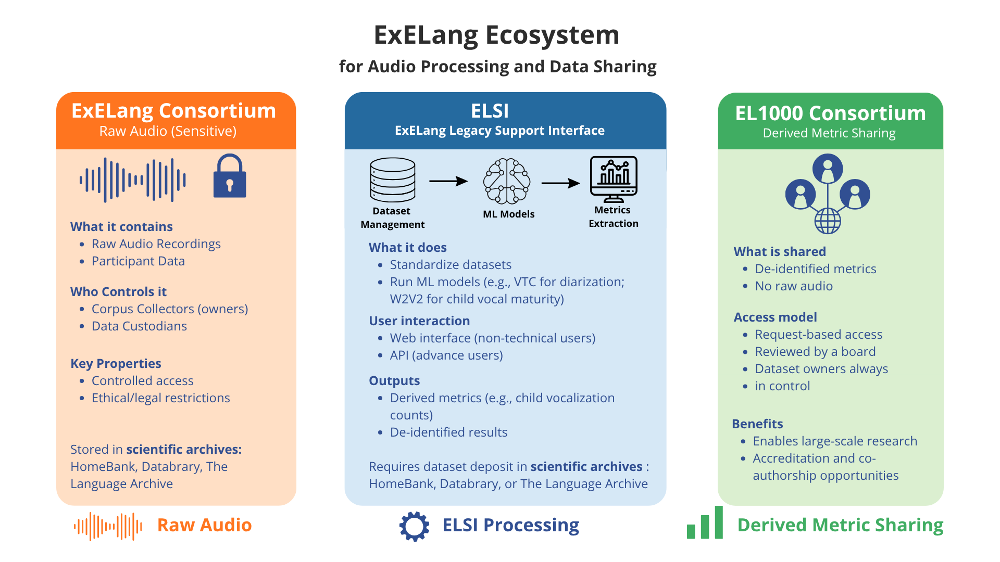

# ExELang Legacy Ecosystem
**A guide for collaborators and external researchers**
*Version 4.0 — June 2026*

For four years, the ExELang project has worked to advance how we study language acquisition through long-form audio recordings — building open-source tools, training models, and bringing together datasets from around the world. As the project comes to an end, our goal is to make sure this work doesn't disappear with it.

This document presents the ExELang Legacy Ecosystem: the tools and agreements we've put in place so that the research community can keep benefiting from this work — today and in the years to come.

The ecosystem has three parts, shown below: the **ExELang Consortium**, **ELSI**, and the **EL1000 Consortium**. If you are an ExELang collaborator, you have already been provided with information regarding how to join one or more of these. Outside researchers will not be able to join because the ExELang team doesn’t have the resources to onboard new people. However, we are not the future decision-makers: our collaborators are. In the future, if they find new resources, they may be able to open one or more of these to external researchers.

---

## 1. ExELang Consortium — Sharing Raw Audio to Facilitate Tool Creation

Over the course of the ExELang project, many researchers shared their raw audio recordings with the ExELang team — we call them **corpus collectors**. The ExELang Consortium is the agreement that lets this collaboration continue: corpus collectors give a small group of researchers, called **custodians**, access to their recordings so they can keep developing and improving machine learning models for speech and language research.

Corpus collectors always remain in control of their own data. All data is shared via established scientific archives — HomeBank, Databrary, or The Language Archive — which provide the ethical and legal safeguards for responsible data sharing.

The custodians use the data specifically to build and test models — and every dataset is properly cited in the resulting publications. If a custodian wants to use the data for a different kind of research, they have to ask first, and the corpus collector can choose to withdraw their data or join as a co-author.

> **Why it matters:** Building good speech and language models requires large amounts of diverse data — the kind that no single lab could collect alone. By pooling recordings from different languages and communities, this consortium helps build models that work better for more people.

---

## 2. ELSI — ExELang Legacy Support Interface

ELSI (ExELang Legacy Support Interface) is a software platform developed by the ExELang team to enable researchers, regardless of technical background, to manage standardized datasets, extract automated annotations generated by machine learning models, and extract metrics from child-centered long-form recordings.

For corpora that were shared during the ExELang project, automated annotations include:
- Voice type classification (who speaks when; VTC1 and VTC2)
- For non-key child vocalizations: child-vocalization adjacency (a proxy for addressee)
- For key child vocalizations: vocal maturity classification (cry, laughing, canonical speechlike, non-canonical speechlike)

**What corpus collectors get:** Their dataset in a standardized format, including all of the automated annotations created during ExELang. The ability to easily extract key metrics (like child vocalization counts). At this time, ELSI is available to corpus collectors who shared data with the ExELang project. It is not yet open to external users.

> **Why it matters for the field:** ELSI may not only make cutting-edge speech processing tools accessible to researchers with no technical background, but also help standardize datasets, making it easier to work with many datasets together for third parties (e.g. in the ExELang Consortium, in the EL1000 Consortium).

### Temporal note

As the ExELang funding is coming to an end, here are our plans for ELSI:

1. We want to use ELSI to return automated annotations to corpus collectors who shared data with the ExELang project. We intend to make ELSI accessible to these corpus collectors as soon as possible. Please note that **ELSI will be closed in November 2026**.
2. We will open source the ELSI source code, so that others can build on it.
3. Members of the team are developing a fee-based platform open to any research lab through SIEL (aka ELSI-business) — this is explained in [Section 4](#4-siel--elsi-business).

---

## 3. EL1000 Consortium — Sharing Derived Metrics

EL1000 takes a different approach to collaboration. Instead of sharing raw audio, corpus collectors share **derived metrics** — numbers and measures extracted from their recordings, such as how often a child vocalizes, with no raw audio involved.

Anyone (regardless of whether they are part of the consortium or not) can submit a research proposal to re-use the derived metrics. A steering board reviews every research proposal for ethical concerns and technical feasibility, and informs the original researchers before anything is released. Corpus collectors can always choose to withdraw their data from a specific project, or join as co-authors.

> **Why it matters:** This makes it possible to study language acquisition at a scale — across languages, cultures, and continents — that would be impossible for any single research team. And because no raw audio is shared, it offers a model for large-scale collaboration that fully respects participants' privacy.

---

## Want to know more?

- For details on how the ExELang Consortium works: see the **[ExELang Consortium Information Booklet](https://laac-lscp.github.io/exelang-consortium-information-booklet/)**.
- For details on how EL1000 works: see the **[EL1000 Welcome Package](https://osf.io/s53kq/wiki?wiki=pxn28)**.
- Visit the **[ExELang legacy website](https://elsi-lscp.ddns.net/docs/)**.
